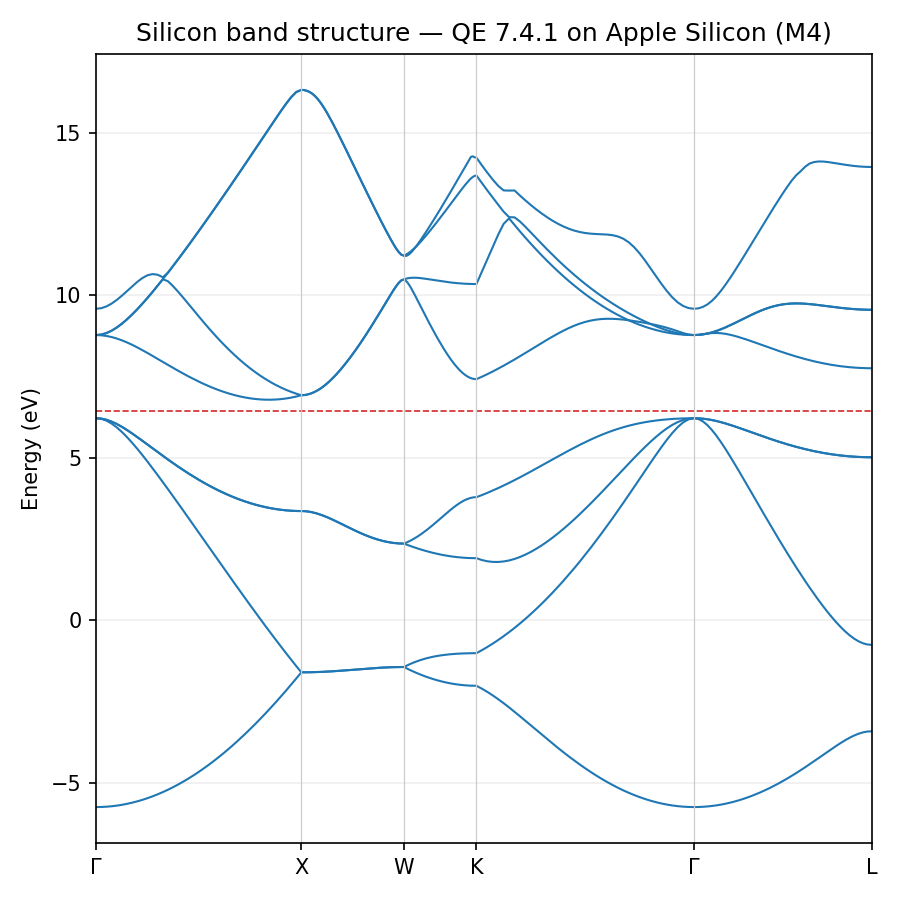
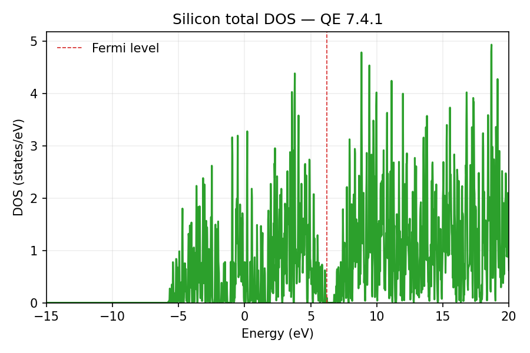

# QE on Apple Silicon (M4)

> Reproducible Quantum ESPRESSO 7.4.1 workflow on macOS 15.3 (Sequoia) using Homebrew GCC + OpenMPI + veclibfort (Accelerate).



## Contents

1. [Quick start](#quick-start)
2. [Environment snapshots](#environment-snapshots)
3. [Silicon example](#silicon-example)
4. [Helper scripts](#helper-scripts)
5. [Docs & Wiki](#docs--wiki)

## Quick start

```sh
git clone https://github.com/shahpoll/qe_macm4_build.git
cd qe_macm4_build
brew install gcc open-mpi cmake veclibfort openblas wget python
./docs/AppleSilicon_QE_Guide.md   # follow step-by-step playbook
```

- **Accelerate toolchain** already configured under `artifacts/q-e-qe-7.4.1`.
- **SCF sanity check**: `mpirun -n 2 artifacts/q-e-qe-7.4.1/bin/pw.x -in inputs/Si.scf.in`.
- **Report bundle**: `qe_macm4_attempt_bundle_v3.zip` collects logs, docs, plots.

## Environment snapshots

- `logs/system.txt` — OS/kernel/date, CLT path, PATH content.
- `logs/versions.txt` — Homebrew packages, `gfortran`, `mpirun`, `cmake` versions.

## Silicon example

Artifacts reside under [`cases/si/manual`](cases/si/manual/README.md) (manual workflow)
and [`cases/si/pwtk`](cases/si/pwtk/README.md) (PWTK workflow).

| File | Description |
|------|-------------|
| `inputs/Si.scf.in` | Baseline SCF input (Γ-point).
| `inputs/Si.nscf.in` | 12×12×12 NSCF grid for DOS/PDOS.
| `cases/si/manual/logs/*.txt` | Full QE transcripts (SCF → NSCF → bands → DOS → projwfc).
| `cases/si/manual/data/silicon.dos` | Total DOS sampled from -15 to 20 eV.
| `cases/si/manual/data/si_band_summary.txt` | Fermi level and indirect/direct gaps.
| `cases/si/manual/plots/si_total_dos.png` | DOS (Accelerate build).
| `cases/si/manual/plots/si_pdos.png` | s/p-projected DOS per atom.

> 

## Helper scripts

Located in [`scripts/`](scripts):

- `plot_si_bands.py` — render Γ–X–W–K–Γ–L band structure.
- `plot_si_dos.py` — total DOS visualization (`silicon.dos`).
- `plot_si_pdos.py` — overlay s/p PDOS from `projwfc.x` outputs.
- `analyze_si_bandgap.py` — compute indirect/direct gaps from band data.

All scripts accept a `--base` argument (default `cases/si/manual`) and a `--pwtk`
shortcut for `cases/si/pwtk`, so each workflow regenerates its plots in-place.

All scripts use Matplotlib; install once via `python3 -m pip install --user matplotlib`.

## Docs & Wiki

- `docs/AppleSilicon_QE_Guide.md` — full setup guide (macOS Sequoia + CLT 16).
- `docs/Guide.md` — quick checklist.
- `docs/Si_Worklog.md` — chronological command log with macOS vs Ubuntu notes.
- `docs/Troubleshooting.md` — known issues (CPP override, FoX, Metal GPU status).
- `docs/wiki/` — ready-to-publish pages for the GitHub wiki (Environment, Workflow, Troubleshooting, Results).

**Wiki suggestions:**

- Environment notes (OS/CLT quirks, veclibfort vs OpenBLAS).
- Troubleshooting FAQ mirrored from docs.
- Workflow recipes (Accelerate path today, OpenBLAS/CMake when fixed).
- Results gallery (embed band/DOS plots, band-gap summary).
